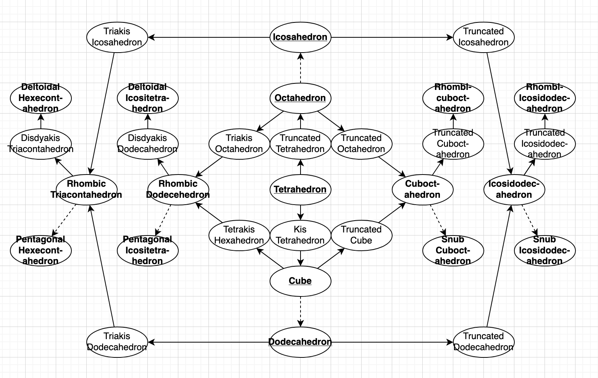

# SHAPE SHIFTER 250

An in-progress game(?) where you try to build as many polyhedra you can using interactive versions of Conway operations.

Although there isn't an indication in the UI of this yet, you can hold Control (or Command on MacOS) to select a group of corners/faces to target (i.e. instead of always targeting all of them). Additionally, to perform the Snub or Gyro moves when you're able, hold Shift. Finally, the hotkeys C, G, and F allow you to experiment with different ways of “smoothing out” complex polyhedra.

Currently, only 31 polyhedra have programmed names: the Platonic, Archimedean, and Catalan solids. The way to make each of them is pictured in the diagram below (arrows to the right are truncation/rectification/snub and arrows to the left are kis/join/gyro, un-bolded names represent a truncation/kis, and a dashed arrow represents a snub/gyro). The Johnson Solids and their duals are achievable (there are 92 of each), but their names are not programmed in yet, so you won't get credit for them. The remaining 35 polyhedra needed to reach a total of 250 are not supported in any real way yet - they will be the dihedra, prisms, antiprisms, bipyramids, and trapezohedra for 3 through 9 sides.

**Warning:** Currently, *almost all of the code in this repo is AI-generated*. The core of the app is based on the notes I wrote below, but the visuals were developed in a more iterative fashion (since I ended up needing to see some examples to decide what I wanted to go with for this first version). Despite this, some of the text is my own – especially the strings in `src/config.ts`, but also some of the code in `src/main.ts` and `src/ui/readout.ts` (among a few others – since sometimes it was easier and faster to just go and fix something myself).

### Original Notes

Clicking and dragging a degree-n vertex inwards along a connected edge:
- Truncate (variable): break up vertex into n many degree-3 vertices surrounding an n-gon face
- Rectify/Ambo: new vertices combine along old edges, deleting old edges
- Mouse can be anywhere, but snap to the closest original edge facing the camera when calculating how far it’s been dragged
- The new vertex on that edge should be exactly at the mouse’s snapped position
- Minimum is the original vertex position (does nothing if the mouse is released here) and maximum is at rectification

Clicking and dragging the center of an n-gon face outwards along its normal:
- Kis (variable): break up face n many 3-gon faces surrounding an n-deg vertex
- Join: new faces combine along old edges, deleting old edges
- Mouse can be anywhere, but snap to a perpendicular line from the center when calculating how far it’s been dragged
- The new center vertex should be exactly at the mouse’s snapped position
- Minimum is when the vertex is flush with the face (does nothing if the mouse is released here) and maximum is at joining

Holding shift while dragging a degree-2n vertex (i.e. partway through a truncation/rectification):
— Snub: Morphs the truncation/rectification (frozen at its current level) into a snub by breaking up the new face into n many 3-gon faces surrounding an n-gon face, or just an edge if n=2
- If the snub operation is stopped in the middle (unlike gyro, see below) then the result should only be considered "partial", since the new vertices are not unified like in a proper snub
- This only applies to vertices of even degree, so if any of the vertices to which this would apply are odd degree  - or if the vertices are not all connected or contain an odd cycle, which would leave us unable to determine a consistent chirality - holding shift does nothing
- Mouse can still be anywhere and still snaps to an original edge, but now dragging along the edge instead moves outward the vertices that are only part of the new 3-gon faces, and inward the vertices that are also part of the new n-gon face, skewing the proportions of the faces
- By changing which edge you drag along, you can change which chiral form you get

Holding shift while dragging a 2n-gon face (i.e. partway through a kis/join):
— Gyro: Morphs the kis/join (frozen at its current level) into a gyro by breaking up the new vertex into n many degree-3 vertices surrounding a degree-n vertex, or just an edge if n=2
- If starting with a kis instead of a join (unlike snub, see above), then the result should only be considered "partial", since the new faces are not unified like in a proper gyro
- This only applies to faces with an even number of sides, so if any of the faces to which this would apply have an odd number of sides - or if the faces are not all connected or have an odd cycle, which would leave us unable to determine a consistent chirality - holding shift does nothing
- Mouse can still be anywhere, but now snaps to the (not visible) lines connecting the center vertex to the midpoints of the 2n outer edges, and dragging along them moves outward the new degree-3 vertices (which are connected to the center vertex and the outer edge's two endpoints) keeping the center vertex in the center
- By changing which line you drag along, you can change which chiral form you get

After releasing the mouse:
- Forces are applied to vertices in order to bring them into a correct configuration
- First, faces are made to be planar - if this does not converge after a certain amount of time, the polyhedron is invalid
- If faces are planar, then with some damping over time, forces are applied to vertices to try and make the faces regular

Holding command (MacOS) or control (non-MacOS) before dragging:
- Allows you to select multiple vertices (or multiple faces)
- When you start dragging, only the selected vertices (or faces) will be affected, instead of all of them
- The bounds for Rectify (or Join) is calculated based on what it would be if all the vertices (or faces) were selected
- Clicking off before dragging de-selects everything

Hovering:
- Highlights vertices and face-centers that are draggable
- Visual feedback when the mouse gets close enough that clicking and dragging would do something

Representing a polyhedron:
- Internally, a polyhedron should just be a list of vertex positions and how they are connected with edges/faces
- However, additional information should be kept in order to identify what polyhedron it is, specifically:
    - How many vertices of each vertex configuration there are, e.g. the snub square antiprism has 8 vertices with configuration 3.3.3.3.3, and 8 vertices with configuration 3.3.3.3.5
    - How man faces of each face configuration there are, e.g. the rhombic dodecahedron has 12 faces with configuration 3.4.3.4
    - (These configurations should be stored in some canonical form so that, e.g. 3.4.3.4 is treated the same as 4.3.4.3)
- Keep a list of named polyhedra (I can fill this in with lots of polyhedra later) and if the information matches, display the name
- Also check in the background with brute-force whether you can find a one-to-one mapping of vertices between the two (obviously, only trying options that have the same vertex configuration) that share the same connectivity - if so display a checkmark meaning we can verify that it’s the same

### Original Notes That Have Yet to be Implemented

From a Tetrahedron:
- Octahedron: Rectified Tetrahedron
- Cube: Joined Tetrahedron
- Icosahedron: Snub Octahedron
- Dodecahedron: Gyro Cube
- All Archimedean and Catalan solids

From modifying a single face:
- Pyramid Augmentation: Kis
- Prism Augmentation: Truncation on a Pyramid Augmentation
- Cupola Augmentation: Rectification on a Partial Gyro
- Rotunda Augmentation: Truncation then Rectification on a Partial Gyro

Note: Truncation/Rectification/Snub treats edges between degree-2 vertices as digons and will create pairs of degree-2 vertices instead of digons, and in the same way Kis/Join/Gyro treats edges between digons as degree-2 vertices and will create pairs of digons instead of degree-2 vertices 

From n-dihedron:
- n-bipyramid: Kis n-dihedron
- n-hosohedron: Join n-dihedron
- n-prism: Rectified n-dihedron (or Truncated n-hosohedron)
- n-antiprism: Snub n-dihedron (or Snub Kis n-hosohedron)
- n-trapezohedron: Gyro n-hosohedron (or Gyro Truncated n-dihedron)
